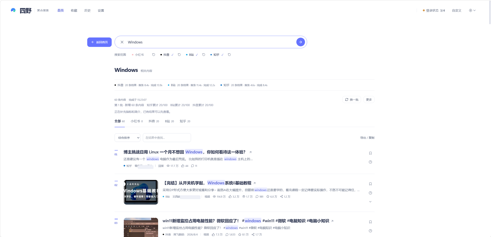

# 四野（SiYe）

> 产品中文名**四野**，仓库与对外 ASCII 标识同为 `SiYe`。

## 中文社交平台聚合搜索

一次搜索小红书、抖音、Bilibili 和知乎，将分散在不同平台的中文内容统一检索、排序和展示。

本项目的产品主体是跨平台搜索，而不是通用爬虫控制台。

> **本仓库是桌面端（Windows）版本。** 同一聚合搜索方向的 Android 客户端由朋友独立开发维护：
> [OpenScope Android](https://github.com/metaMMY07/MediaCrawler)（详见文末「移动端」）。

## 产品截图



- 推广落地页：<https://kellengo.github.io/SiYe/>（仓库内 `site/index.html`，单文件无依赖，可直接部署到静态托管）
- 使用说明：<https://kellengo.github.io/SiYe/guide.html>（仓库内 `docs/使用说明.md`）
- 首页与账号设置截图：`site/shot-home.png`、`site/shot-account.png`

## 文档入口

| 开始了解    | 看哪里                                                                          |
| ------- | ---------------------------------------------------------------------------- |
| 新朋友？➡️  | [落地页](https://kellengo.github.io/SiYe/)（仓库文件 `site/index.html`）         |
| 如何使用？➡️ | [使用说明](https://kellengo.github.io/SiYe/guide.html)（仓库文件 `docs/使用说明.md`） |
| 维护记录➡️  | [`site/维护说明.md`](site/维护说明.md)                                              |
| 源码学习    | 本文下面的「快速开始」「项目架构」「测试」                                                      |

## 为什么做这个项目

查找一个主题时，用户通常要分别打开小红书、抖音、Bilibili 和知乎，重复搜索并手动比较结果。

本项目希望把：

```text
四个平台 × 四次搜索
```

变成：

```text
一次搜索 → 一个结果页
```

## 核心功能

- **四平台并行搜索**：小红书 / 抖音 / Bilibili / 知乎同时搜，单个平台失败、超时不会影响其他平台的结果。
- **一个结果页**：不同平台的结果归一成同一模型，支持「综合 / 最新 / 互动最多」三种排序。
- **跨平台去重**：同一内容合并成一张卡片，展开可看各平台的入口。
- **结果内筛选**：在「导出 / 复制」中按关键词（空格分隔）筛选，命中词高亮；也可切换平台查看。
- **单平台重搜**：每颗平台旁边一个 ⟳，只重搜这一个平台并拿到**与上一轮不重复**的新内容，其它平台完全不动；「换一批」才是往后叠加新内容，「刷新结果」是整组重搜。
- **热搜卡片**：首页按平台看各平台热词，点一条就用当前勾选的平台搜它。
- **首页 / 结果页可以来回切**：结果页左上角的「← 返回首页」不会清掉上次搜索，首页给「查看上次搜索」切回来。
- **没搜到会说清原因**：平台 0 条 / 失败 / 限流 / 未登录都会在页面上方提示并说明原因（抖音被风控时显示「疑似平台风控」），同时自动取消该平台的勾选，不再白搜。
- **收藏与稍后再看**：两个独立快捷按钮，支持默认收藏夹、自建收藏夹、备注、备份与导入。
- **导出**：当前筛选结果或勾选结果导出 CSV / Markdown，或批量复制原文链接。
- **跨平台收藏**：只读拉取四个平台已收藏的内容，统一查看与导出。
- **本地优先**：只监听 `127.0.0.1:8080`，账号、缓存与收藏都不出本机。

### 收藏、导出与跨平台收藏

- 筛选只处理已经返回的结果，不会额外去平台搜索；「最新」按已有发布时间排序。
- 收藏保存在**本机 SQLite**（Windows：`%LOCALAPPDATA%\SiYe\data\library.db`）：换浏览器、升级版本或更换解压目录都不会丢；启动时会自动合并旧目录中的收藏库。上限 500 条，备注最多 1000 字。想额外留一份副本，可在「本地收藏 → 备份管理」点**「导出全部收藏」**导出 JSON，之后可导入恢复。
- 导出默认作用于当前筛选下的全部结果，勾选后只导出选中项；CSV 带 UTF-8 BOM，Excel 打开中文不乱码。
- 跨平台收藏是**只读**的：不会在平台侧添加、删除或移动你的收藏。当前界面每次每平台最多取最近 100 条，实际数量取决于平台返回；已有归档保留。API 的默认请求数量仍为 20 条。

### 稳定性与账号

- 平台明确限流后进入 60 秒冷却，重复触发依次延长到 120 / 240 / 300 秒；其他平台不受影响。
- 搜索前先做一次本地登录预检，确定搜不了的平台立刻提示「需要登录」，不用白等浏览器启动。
- 打开程序会自动同步尚未登录的平台（装了扩展时）；账号设置里可查看各平台状态与诊断信息，也可以用自带扫码登录。
- 各平台跑在隔离的 worker 中，降低相互影响；结果有 90 秒短期缓存，可强制重新搜索。

## 支持平台

| 平台       | 聚合搜索 |
| -------- | ---- |
| 小红书      | ✅    |
| 抖音       | ✅    |
| Bilibili | ✅    |
| 知乎       | ✅    |

其他平台不在当前正式支持范围内。各平台返回的字段略有差异，见「已知限制」。

## 搜索流程

```text
关键词 → 四平台并行搜索 → 统一结果模型 → 摘要补全 / 去重分组 / 排序 → 一个结果页
```

## 快速开始

- **普通用户**：下载 Windows 安装器，按[使用说明](docs/使用说明.md)操作。
- **开发者**：从源码运行，见下面「从源码运行」。

两种方式使用同一个地址：`http://127.0.0.1:8080`。

> **先连接你常用的 1–2 个平台**：在「设置 · 账号与登录」点对应平台的「扫码登录」，程序会在本机打开一个浏览器窗口，
> 用对应平台的手机 App 扫码即可。搜索时只勾选已连接的平台，其他平台以后再添加。不需要安装任何插件。
> 如果你已经在 Chrome / Edge 里登录过这些平台，也可以选择装随包的浏览器扩展（`browser_extension/`）
> 一键同步登录状态 —— 这是**可选加速方式**，不装也能用扫码登录。

### 普通用户：Windows 安装器

1. 下载并运行 **`SiYe-Setup-Windows-x64.exe`**；安装器按当前用户安装，不需要管理员权限；
2. 安装完成后启动「四野」，以后可从开始菜单或你选择创建的桌面快捷方式打开；
3. 浏览器会自动打开；接受使用须知后，可点欢迎卡上的「带我试一次」，跟随新手引导连接平台并搜索。

需要免安装运行时，Releases 仍提供 `SiYe-Windows-x64.zip`。便携版必须完整解压，再双击其中的 `四野.exe`。

新手引导可以「这次跳过」，也可以勾选「以后不再自动提示」后关闭；完成教程后不再自动出现。
在「帮助」页可随时重新开始。偏好保存在当前浏览器，清理浏览器数据后会重置。

关掉页面后程序仍在后台运行；右键右下角托盘图标可「打开四野 / 打开日志目录 / 退出四野」。
想看控制台输出时，也可以直接双击同目录的 `SiYe.exe`（同一份程序，带控制台，也是后端与平台 worker 的实际入口）。
安装包已含 Python runtime、后端和 Web UI，默认监听 `127.0.0.1:8080`，使用系统 Chrome / Edge。

### 从源码运行

需要 Python 3.11+、[uv](https://docs.astral.sh/uv/)、Chrome / Edge（或 Playwright Chromium）；前端开发另需 Node.js 20+。

```shell
uv sync                              # 安装依赖
uv run playwright install chromium   # 可选：安装 Playwright Chromium
MediaCrawler.bat                     # 打开已构建的 dist/SiYe/四野.exe
```

也可以手动启动后端：`uv run uvicorn api.main:app --host 127.0.0.1 --port 8080 --reload`。

> **多个 check-out 并行跑？** 设置环境变量 `SIYE_PORT` 换端口即可（产品默认 8080）。
> `api/main.py`、`desktop_main.py`、`MediaCrawler.bat`、`scripts/start.ps1`（`-Port` 参数）
> 与 `webui` 的开发代理都读同一个变量。例如 `set SIYE_PORT=8090` 后再启动。

前端开发与构建：

```shell
cd webui && npm ci && npm run dev     # 开发，默认 http://localhost:5173
cd webui && npm ci && npm run build   # 构建，产物在 webui/dist/
```

### 常见启动问题

- **8080 端口被占用**：关掉已经运行的本项目实例；程序不会强制抢端口，也不会自动换端口。确实要同时跑两个（例如主目录 + worktree），用 `SIYE_PORT` 给其中一个换端口；浏览器扩展仍只认 8080，换端口的那份请用应用自带扫码登录。
- **提示缺少 `webui/dist`**：进 `webui` 执行 `npm ci` 和 `npm run build`。
- **环境显示 degraded**：看账号设置里的 Platform Doctor；Redis、账号验证或浏览器状态异常不一定会阻止公开搜索。
- **搜索任务失败或结果不完整**：单个平台失败不会阻止其他平台返回结果，可在结果页对失败平台单独重试。

## 账号登录

四野支持两条登录路径，可以在「设置 · 账号与登录」里混用：

**① 应用自带扫码登录（推荐，默认路径）**

1. 打开「设置 · 账号与登录」，在平台卡片上点「扫码登录」；
2. 程序用系统 Chrome / Edge 打开一个可见窗口，用对应平台的手机 App 扫码；
3. 扫码成功后程序会立刻验证这次会话（平台自己的登录态接口），验证通过才写入登录状态，
   卡片状态变为「登录已确认」。先连接常用平台即可，不要求四个平台全部登录。

不需要安装任何插件、不需要开「开发者模式」，也不需要刷新页面。

**② 浏览器扩展同步（可选加速）**

如果浏览器里已经有现成的登录状态，装一次扩展可以省掉扫码：

1. 浏览器打开 `chrome://extensions`（Edge 为 `edge://extensions`），开启「开发者模式」；
2. 点「加载已解压的扩展程序」；安装版选择 `%LOCALAPPDATA%\Programs\SiYe\browser_extension`，便携版选择 `SiYe/browser_extension/`；
3. 在浏览器里登录对应平台，回到「账号与登录」点「从浏览器同步」。

两条路径写入同一个 profile，互不冲突；同一时间只处理一个登录或搜索（后端排他保护）。

登录状态**每次启动都要重新确认一次**：程序打开后会自动复核已有 profile 的登录状态
（需要几秒），确认通过前账号卡片显示「登录待确认」。本地收藏仍可查看；搜索可能等待
复核完成，个人收藏同步需要有效登录。复核不需要浏览器扩展：装了扩展会走扩展同步，没装则直接让后端用
本地 profile 验证一次。

账号状态不等于搜索能力：未通过 API 验证时，平台仍可能通过浏览器备用路径完成公开搜索。

扩展只把必要的会话信息交给本机后端，请只同步你有权使用的账号。详见

[`browser_extension/README.md`](browser_extension/README.md)。

## 项目架构

```text
Web UI（含扫码登录）/ 浏览器插件（可选） → FastAPI → 任务管理 → 隔离 worker → 平台适配层 → 统一结果 → 补全 / 去重 / 排序 / 缓存
```

技术栈：Python 3.11 + FastAPI / Uvicorn + React / Vite / TypeScript + Playwright，各平台跑在独立 worker 进程中。

Provider fallback 只复用已有平台路径：小红书与 B 站可回退浏览器，知乎可回退页面路径，抖音为单一搜索路径。

## 测试

```shell
python -m pytest -q tests/       # 后端
cd webui && npm run test:search  # 前端搜索逻辑
```

CI 在 push / PR 到 `master` 时运行后端测试、前端搜索测试与 build，不依赖真实账号和平台网络。

## 已知限制

- **各平台字段不一致**：小红书、抖音搜索不返回播放量；知乎不返回收藏数；B 站投币数只在详情里。

  跨平台收藏读的是收藏列表接口，字段比搜索更少。这些缺口只能逐条抓详情补齐，当前不为这些数字额外请求。
- 平台访问策略、登录要求和返回字段可能变化，搜索结果稳定性取决于平台当前状态。
- 摘要补全（Result Hydration）是有限数量的后台任务，详情接口不可用时会保留初始结果。
- 跨平台去重基于编辑距离，还需标题、作者或摘要佐证，是规则判断，不等同于语义理解。
- Provider fallback 串行且有界，不会并行竞速或按历史成功率自动择优。
- CI 不进行真实平台搜索；账号登录、浏览器 profile 与风控相关问题需要本地验证。

## 问题反馈

在应用「帮助」页点「复制诊断信息」，预览后自行粘贴到 [GitHub Issues](https://github.com/KellenGO/SiYe/issues)。
也可下载诊断 JSON；复制失败时可手动选中报告。报告仅含本机环境、状态、时间及数量，
不包含 Cookie、昵称、搜索词、内容、文件路径或完整日志，不会自动上传或发起平台搜索。
本地服务不可达时仍可生成部分报告；请同时描述你做了什么、期望发生什么、实际看到了什么。

## Roadmap

- 继续调优搜索相关性和跨平台结果质量。
- 从去重分组进一步完善同内容的跨平台聚合。
- 优化搜索速度、冷启动和浏览器资源使用。
- 完善失败重试、账号同步和平台诊断体验。
- 根据实际需要评估更多平台接入。

## 移动端（Android）

本仓库只发布 Windows 桌面端。移动端的同源项目由朋友独立开发与维护：

- **[OpenScope Android](https://github.com/metaMMY07/MediaCrawler)** —— Kotlin + Jetpack Compose + Material 3，
  面向 B站 / 知乎 / 小红书；在 App 内的官方页面登录，不依赖 PC、Termux 或 root。
- 下载：<https://github.com/metaMMY07/MediaCrawler/releases/latest>

两边代码库、发布节奏与支持平台各自独立（桌面端含抖音），问题请到对应仓库反馈。
移动端同样适用上游的非商业学习许可。

## 与原 MediaCrawler 的关系

本项目基于 / fork 自 [NanmiCoder/MediaCrawler](https://github.com/NanmiCoder/MediaCrawler)。感谢原作者提供底层多平台采集能力和项目基础。

当前仓库在其基础上开发并维护跨平台聚合搜索产品，包括统一结果模型、Provider Chain、排序、snippet、Hydration、跨平台去重与分组、缓存、账号状态和搜索 UI 等能力。上游更新会根据需要选择性吸收。

本项目的修改与新增部分同样适用上游的非商业学习许可；上游的版权声明与 LICENSE 全文保留在仓库根目录，二次分发时请一并保留。

## License / Disclaimer

本项目保留 MediaCrawler 的 [NON-COMMERCIAL LEARNING LICENSE 1.1](LICENSE)。使用本项目之前请阅读许可证全文。

- **可以**：在个人学习、研究、非商业用途下免费下载、安装、使用，以及复制、修改、合并代码（须保留版权与许可声明）。
- **不可以**：任何商业用途或盈利活动；商用须取得版权所有者书面同意。
- **不可以**：大规模抓取，或干扰、破坏目标平台的正常运营。
- **不可以**：删除或篡改上游版权声明与许可证全文。
- 软件按「现状」提供，不提供任何明示或暗示的担保；因违规使用造成的一切后果由使用者自行承担。
- 本项目与各目标平台没有任何隶属、合作或授权关系，平台名称与商标归各自权利人所有。
- 不得侵犯他人隐私、知识产权或其他合法权益。
- 不得用于任何违法或未经授权的用途。
- 商业使用必须遵循原许可证要求，并取得版权所有者的必要书面授权。

本 README 介绍的是当前仓库的聚合搜索产品。底层能力的来源、版权和许可限制仍以本仓库的 `LICENSE` 文件及 [上游仓库](https://github.com/NanmiCoder/MediaCrawler) 的 attribution 为准。
