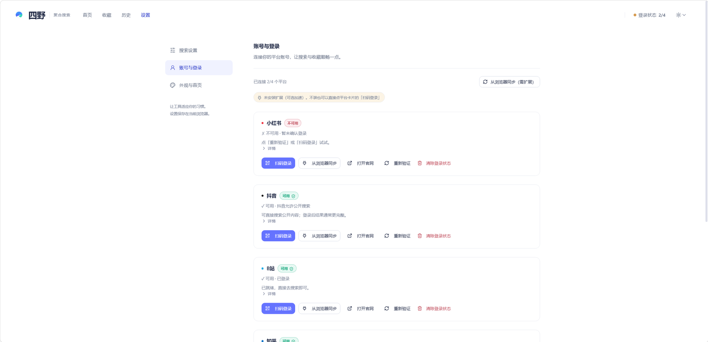

# 四野 · 使用说明

先连接你常用的 1–2 个平台，再搜一个感兴趣的话题；其他平台以后再添加。

> 网页版说明：<https://kellengo.github.io/SiYe/guide.html>

---

## 第一次使用：跟随教程，或自己试试

接受使用须知后，欢迎卡会提供「带我试一次」。四步教程会带你认识账号、搜索、收藏和帮助页面，提示卡留在页面上，你可以边看边操作，准备好后点「下一步」。

- 点「这次跳过」：当前标签页会话内不再提示，刷新也不会重复出现。
- 勾选「以后不再自动提示」再关闭：当前浏览器记住选择；完成教程也会停止自动提示。
- 想再看一次：在「帮助」点「重新开始新手引导」。

教程不会替你扫码、发起搜索或同步收藏。清理浏览器数据、换浏览器或更换访问端口，会重置教程偏好。

## 开始前，先连接常用的平台

### 1. 用四野自带的扫码登录

打开四野，进**「设置 · 账号与登录」**，在平台卡片上点**「扫码登录」**。四野会在你电脑上打开一个浏览器窗口，用**小红书、抖音、B 站、知乎**的手机 App 扫一下即可；登录成功后窗口自动关闭，卡片状态变成「登录已确认」。

四野是**借用你本人的登录状态**去替你搜索的。先选常用的 1–2 个平台完成登录，搜索时只勾选它们；需要其他平台时再去连接。

不需要安装任何插件，不需要开「开发者模式」，也不需要刷新页面。

> 某个平台提示「需要登录」时，去账号页连接该平台即可；不用等四个平台全部登录才开始体验。

### 2. 可选：用浏览器扩展同步登录状态

如果你平时就在 Chrome 或 Edge 里登录着这些平台，可以装一次四野的浏览器扩展，把你浏览器里现成的登录状态直接同步过来，省掉四次扫码。这是**可选加速方式**：不装也能用扫码登录，两者可以混用。

1. 浏览器地址栏输入 `chrome://extensions`（Edge 是 `edge://extensions`）回车；
2. 打开右上角的**「开发者模式」**；
3. 点**「加载已解压的扩展程序」**，安装版选择 `%LOCALAPPDATA%\Programs\SiYe\browser_extension`；便携版选择解压目录里的 `SiYe/browser_extension/`；
4. 回到四野页面，打开**「账号与登录」**，点平台卡片的**「从浏览器同步」**。

> **什么时候值得装？** 你已经在浏览器里登录过这几个平台、想省掉扫码的时候。
> 它只做一件事：把你浏览器里已有的会话交给本机的四野，不读取其他数据，也不上传任何东西。

---

## 下载与启动

1. 从官方 Release 下载并运行 `SiYe-Setup-Windows-x64.exe`；
2. 按安装向导继续。四野默认安装到当前用户目录，不需要管理员权限；桌面快捷方式可按需勾选；
3. 安装完成后启动「四野」，以后可从开始菜单打开。浏览器会**自动打开** `127.0.0.1:8080`，就可以搜了。

需要免安装运行时，可下载 `SiYe-Windows-x64.zip`，**整个解压**后双击其中的 `四野.exe`。不要只复制单个 EXE，旁边的运行文件也必须保留。

> 不需要安装 Python、Node.js，也不用敲命令。
> 关掉浏览器页面程序仍在后台运行，想彻底退出就右键右下角托盘图标选**「退出四野」**；
> 托盘菜单还有「打开四野」和「打开日志目录」。
> 开始时先扫码连接常用的平台，也可以跟随应用内的新手引导。

> **第一次运行被 Windows 拦下来？**
> 安装器尚未购买商业代码签名证书，SmartScreen 可能弹「Windows 已保护你的电脑」。只从项目官方 Release 下载，建议先核对同页的 SHA256，再点**「更多信息」→「仍要运行」**。
> 杀毒软件误报时把安装目录加进白名单。程序只在本机 `127.0.0.1:8080` 监听，不对外提供服务，也不上传任何数据。

---

## 开始搜索

在搜索框输入关键词，勾上已连接、想要搜索的平台，回车。选中的平台会**同时**搜，谁先回来谁先显示；某一个失败或超时，其他平台照常出结果。

想换个排法就切**综合 / 最新 / 互动最多**；想缩小范围就打开**「导出 / 复制」**，在「在结果中查找…」输入关键词，多个词用空格分隔。也可以切换平台查看。筛选只对已经搜回来的结果生效，不会重新去搜；当前没有时间范围和内容类型筛选控件。

### 只补一个平台：⟳ 单平台重搜

搜索范围那一排，每颗平台旁边都有一个 ⟳。点它只重搜这一个平台（其它平台完全不动），拿到的是**与上一轮不重复的新内容**，替换掉它原来那一份；这个平台这一轮没搜过、点它就是把它补进来。它和「换一批」不是一回事：

- **⟳ 单平台重搜**：只跑一个平台，替换它自己的内容，不新增批次；
- **换一批**：四个平台各往后翻一页，**往后叠加**一批新内容；
- **刷新结果**（在「更多」里）：整组重搜一遍，替换当前视图。

### 回到首页看看别的

结果页左上角有**「← 返回首页」**：回首页**不会清掉**这次搜索，首页上的**「查看上次搜索」**能再切回来，两个页面可以来回看。

首页还有**热搜卡片**：按平台切换看各平台当前的热词，点一条就直接用当前勾选的平台搜它（只在进入软件时取一次，之后点「刷新」更新）。

### 某个平台没搜到会说明原因

某个平台这一轮**没搜到东西**时，页面上方会弹一次提示，说明原因，并自动取消它的勾选（下次不白搜一遍）；平台状态条上也会一直显示这条原因。常见几种：

- **疑似平台风控**：平台正常应答但返回 0 条。这通常是你这个账号 / 网络被平台暂时限流，换关键词、重新登录都没用，**过一段时间再试**即可；
- **需要登录**：登录态失效，按提示去「账号与登录」重新登录；
- **被平台限流 / 超时**：稍等一会儿再搜，其它平台不受影响。

---

## 搜到之后还能做什么

- **收藏、稍后再看与备注**：每张结果卡右侧依次是「收藏」「稍后再看」和「展开」（有详情时）。前两个按钮互不影响；在「本地收藏」可查看「全部／默认收藏夹／稍后再看」，编辑其他收藏夹归属并添加备注（最多 1000 字，上限 500 条）。
- **导出**：点「导出 / 复制」，可以导出 CSV（Excel 打开中文不乱码）、Markdown，或批量复制原文链接。不勾选就导出当前全部，勾选了只导出选中的。
- **跨平台收藏**：把你在各平台已经收藏过的内容拉到一页里统一看（界面每次每平台最多取 100 条，实际数量取决于平台返回；只读，不会改动你在平台上的收藏）。旧归档保留，也可以取消正在进行的同步。

> **收藏存在本机**：数据落在 `%LOCALAPPDATA%\SiYe\data\library.db`，清除浏览器数据、换浏览器、升级版本或更换解压目录都不会丢。新版首次启动会自动合并旧程序目录里的收藏库，并保留旧文件。
> 想额外留一份副本，在「本地收藏 → 备份管理」点**「导出全部收藏」**下载 JSON，之后可用「导入收藏备份」恢复。这份备份包含本地收藏、收藏夹归属和备注，不包含平台登录资料。

---

## 常见问题

**搜不出东西 / 提示需要登录**
到「账号与登录」检查出问题的平台，按提示扫码登录；搜索时可先取消勾选暂时不可用的平台。如果提示是**「疑似平台风控」**，说明登录是好的、是平台暂时不给内容（换词、重登都没用），过一段时间再试；其余情况仍有问题时，在「帮助」复制诊断信息反馈。

**重开程序后显示「登录待确认」**
程序会自动检查本机已有的登录状态，通过后显示「登录已确认」。本地收藏仍可查看；搜索可能等待检查结束，同步个人收藏则需要有效登录。如果一直未确认，可重新扫码登录。

**扫码登录后窗口没反应**
登录窗口最长等 10 分钟，请确认手机 App 已扫到二维码。期间不能同时搜索或同步；关掉窗口重开一次即可。

**扫码时提示有其他操作在进行**
四野同一时间只允许一个登录窗口或一次搜索。等当前操作结束（或搜索完成后）再试。

**某平台结果特别少**
平台风控、关键词太窄、字段变化都会导致。建议当作参考，不要当成完整数据。

**提示限流冷却**
本地会等 60 秒，反复触发延长到 120 / 240 / 300 秒。**其他平台不受影响**，冷却结束手动重试。

**第一次搜索很慢**
首次要启动浏览器，之后快很多；同样的关键词 90 秒内有缓存，会立刻返回。

**双击没反应**
确认是完整解压、目录可写。若托盘图标已出现，右键选「打开四野」或「打开日志目录」；需要查看启动报错时，可运行同目录的 `SiYe.exe` 控制台版。

**8080 端口被占用**
可能是四野或其他程序占用了端口。已有四野时通过托盘「打开四野」进入；需要重启时先在托盘选「退出四野」。不要关闭不认识的进程。

**收藏不见了**
先打开「本地收藏」查看恢复摘要。新版统一读取 `%LOCALAPPDATA%\SiYe\data\library.db`，并会自动合并项目根、旧 `dist/MediaCrawler` 和 `dist/SiYe` 中的旧库；同步时某个平台未登录也不会删除它以前的本机归档。若页面显示迁移警告，旧文件仍在原处，可用「备份管理」导入之前导出的 JSON。

**能商用吗**
**不能。** 本项目为非商业学习许可，严禁任何商业用途或盈利活动，详见[许可与免责声明](https://kellengo.github.io/SiYe/#license)。

---

## 遇到问题：复制诊断信息

在应用「帮助」页点「复制诊断信息」，生成后会显示预览。检查内容后，自行点「提交问题反馈」并粘贴报告；也可下载 JSON。浏览器不允许复制时，选中预览内容手动复制即可。

报告只包含版本、浏览器类型、平台状态、时间、数量及耗时，不包含 Cookie、昵称、搜索词、结果正文、收藏内容、文件路径或完整日志。生成时只读取本机状态，不发起平台搜索，也不自动上传。服务不可达时仍可生成部分报告；空值表示没有取得该项信息。

请附上操作步骤、期望结果和实际看到的提示。扫码或风控问题也可以反馈，不需要先排除原因；请勿上传整个 `data/`、`browser_data/` 目录。

## 隐私与许可

- **可以下载使用**：个人学习、研究、自用免费，不需要付费或授权；
- **不能商用**：严禁用于任何商业用途或盈利活动，商用须取得版权所有者书面同意；
- **不能大规模抓取**：仅限学习研究，不得批量采集或干扰平台正常运营；
- **后果自负**：因违规使用造成的一切后果由使用者自行承担；
- 账号 profile、缓存、收藏全部存在**本机**，后端只监听 `127.0.0.1:8080`，不上传任何数据。

完整条款见[许可与免责声明](https://kellengo.github.io/SiYe/#license)与仓库中的 [LICENSE 全文](https://github.com/KellenGO/SiYe/blob/master/LICENSE)。

还有问题？到 [GitHub Issues](https://github.com/KellenGO/SiYe/issues) 提。
